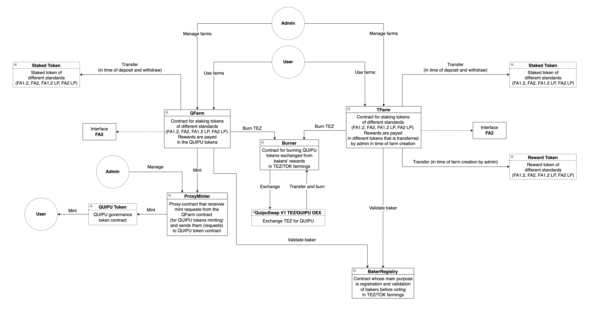

# Quipuswap Farming

The smart contracts system for the Quipuswap Farmings.

The smart contracts support two versions. In the first case, the contracts
allow to stake the LP shares or single assets (both, FA1.2 and FA2, standards)
to earn QUIPU tokens. The second version enables staking of the LP shares or
single assets (also both, FA1.2 and FA2, standards) to earn the other tokens.

Interface fee is supported, incentivising the other solutions to integrate
farms into their interface.

# Architecture



# Requiremets

- Installed [NodeJS](https://nodejs.org/en/) (tested with NodeJS v15+);
- Installed [Yarn](https://classic.yarnpkg.com/lang/en/docs/install/#mac-stable);
- Installed node modules:

  ```shell
    yarn install
  ```

# Compiling

Compilation is splitted into a few steps.

To compile all contracts (without lambdas) run the next command:

```shell
  yarn compile
```

To just compile `QFarm` and `TFarm` lambdas run the next command:

```shell
  yarn compile-lambdas
```

Also, you can compile `QFarm` or `TFarm` lambdas separately. For this purpose
run one of this commands:

```shell
  yarn compile-qFarm-lambdas
  yarn compile-tFarm-lambdas
```

Full compilation of contracts and all lambdas can be done with the following
command:

```shell
  yarn full-compile
```

# Testing

To run all the tests execute the next command:

```shell
  yarn start-sandbox && yarn test
```

# Deploy

To deploy the contracts you should run the following command:

```shell
  yarn migrate
```

By default, the contracts will be deployed to the `development` network (in the
Docker container).

Also, you can specify the network for deploying (possible networks:
`hangzhounet`, `ithacanet`, `mainnet`):

```shell
  yarn migrate -n [network_name]
```

Or just execute one of this commands:

```shell
  yarn migrate-hangzhounet
  yarn migrate-ithacanet
  yarn migrate-mainnet
```
